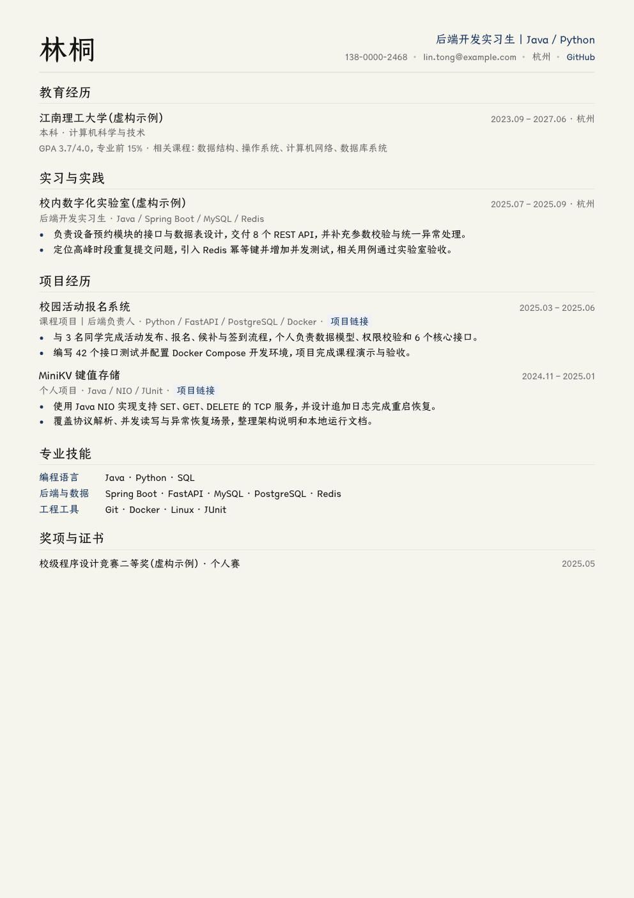

# 乔木大学生简历

> 不知道简历该写什么？不用填巨型表格。让 AI 每次只问一个问题，把真正做过的项目、实习和校园经历聊透，再生成一份可投递 PDF。

[](https://github.com/joeseesun/qiaomu-campus-resume/stargazers)
[](https://github.com/joeseesun/qiaomu-campus-resume/commits/main)
[](LICENSE)

```bash
npx skills add joeseesun/qiaomu-campus-resume
```

## 你可以直接这样说

- “我没有简历。一次问我一个问题，收集完整后生成后端实习简历。”
- “这是我的旧简历和岗位 JD，先指出事实缺口，再采访我补齐。”
- “像 Grill Me 一样追问我的项目，但不要替我编数字。”



## 它解决什么

学生往往不是“没有经历”，而是不知道哪些经历值得写，也说不清个人贡献、难点和结果。这个 Skill 会把简历制作分成两段：先对话采集并确认事实，再生成文件。

- 一次只问一个高价值问题，问题附带当前判断，用户可以直接纠正。
- 沿一项经历深挖“个人贡献 → 行动 → 结果 → 证据 → 面试可解释性”，不在项目之间乱跳。
- 每 2–3 轮复述已确认事实和缺口，避免模型偷偷补全。
- 用确定性的 `assess_interview.py` 检查目标、教育、证据、技能关联、疑点和本人确认。
- 默认只生成一份最适合岗位与内容密度的单栏 HTML/PDF；用户明确要求对比时才批量生成主题。
- 所有内容默认在本地处理，不需要账号、API key 或云端上传。

## 对话会怎么进行

示例：

```text
当前判断：你的课程 API 项目比社团经历更能证明后端能力；如果判断错了请直接纠正。

先问一件事：在这个项目里，你本人独立或主要负责的部分是什么？
```

用户回答后，下一轮只追问当前经历中最影响简历表达的缺口。两项核心经历形成证据闭环、技能能关联到实际使用场景、时间线无冲突，并且用户明确确认事实摘要后，才生成最终 PDF。

用户随时可以说“跳过”“不知道”“停止采访”或“先出草稿”。信息不足时会交付已确认事实和精确缺口，不会用虚构内容填满页面。

## 输入与输出

输入可以是旧简历、零散经历、岗位 JD、项目仓库或纯对话回答。扫描型 PDF 需要用户同意后才能 OCR。

默认输出：

```text
interview-ledger.json  本地事实账本、证据关联、疑点和确认状态
resume-data.json       可渲染内容与 evidence_type
resume.html            可编辑、可本地打印版本
resume.pdf             A4 文本型投递版本
validation.json        内容、排版、字体和 PDF 检查结果
```

最终 PDF 默认一份。只有用户明确说“生成六种比较”或指定 ResumeCollection 预设时，才会生成多套版本。

## 版式与字体

- 默认单栏、标准章节、反向时间顺序，兼顾 ATS 文本读取。
- 可选 ATS 经典、Kami 编辑式、瑞士现代、技术工程、校园清新、高密信息六套主题。
- 可显式选择 `rc-003`、`rc-071`、`rc-102`、`rc-109`、`rc-150`、`rc-214` 六个 ResumeCollection 安全重构预设。
- 使用拉丁/CJK 分层字体与印刷字阶；日期和数字使用表格数字对齐。
- 允许细横向 `border-bottom` 分割线；禁止圆角框、闭合边框、顶边、侧边线、侧边栏和照片。
- HTML 与 PDF 来自同一份 JSON；PDF 检查 A4、1–2 页、未加密、文字可提取和目标字体嵌入。

## 前置条件

- [ ] Python 3：运行 `python3 --version`；macOS 可用 `xcode-select --install` 安装命令行工具。
- [ ] Chrome、Chromium 或 Edge：运行浏览器的 `--version`；用于本地打印 PDF。
- [ ] Poppler：运行 `pdfinfo -v` 和 `pdftotext -v`；macOS 可用 `brew install poppler`。
- [ ] Kami 字体：只有选择 Kami 主题时需要已授权的 TsangerJinKai02 W04；字体不会随 Skill 分发。

## 本地验证

```bash
python3 scripts/validate_skill.py .
python3 scripts/trigger_eval.py . --cases evals/trigger_cases.json --output reports/trigger-eval.json
python3 -m unittest discover -s tests -v
python3 scripts/assess_interview.py assets/example-interview-ledger.json
python3 scripts/validate_resume.py assets/example-resume.json
```

生成一份 Kami PDF：

```bash
python3 scripts/render_resume.py assets/example-resume.json --theme kami --output-dir output --basename resume
```

需要六主题对比时：

```bash
python3 scripts/render_resume.py assets/example-resume.json --all-themes --output-dir output --basename resume
python3 scripts/validate_style_set.py assets/example-resume.json output/resume_六风格清单.json --output output/validation-all.json
```

命令通过不等于审美已验收。PDF 还必须按 `references/visual-and-pdf.md` 转成逐页图片并实际检查裁切、重叠、断行和异常空白。

## 风险与边界

- 不虚构经历、职责、奖项、技术栈或数字；不会为了量化而诱导学生猜结果。
- 不承诺 ATS 分数、面试邀约、薪资或就业结果。
- 不处理学术申请 CV、资深高管简历、作品集网站、求职信、模拟面试或职位代投。
- 联系方式、原始访谈和私人仓库默认只保存在用户指定的本地目录。
- `interview-ledger.json` 与 `resume-data.json` 可能含私人备注；公开分享前应优先只发送 PDF/HTML，并检查 JSON。

## Troubleshooting

| 问题 | 常见原因 | 解决 |
|---|---|---|
| 采访一直不能进入生成 | 只有一项完整经历、技能没有证据关联，或尚未明确确认 | 运行 `python3 scripts/assess_interview.py interview-ledger.json`，按 `next_questions` 补最关键的一项 |
| 找不到 Chrome/Chromium/Edge | 渲染器未找到浏览器 | 设置 `RESUME_BROWSER="/path/to/chrome"` 后重试 |
| 旧 PDF 没有文字 | 文件是扫描件 | 先征得用户同意，再走本地 OCR；不要静默上传第三方 |
| 内容超出一页 | 弱相关信息过多或 bullet 重复 | 先删弱信息、合并重复表达；正文不得低于 9pt，必要时使用两页 |
| Kami 中文字体校验失败 | 未安装获授权的 TsangerJinKai02 W04 | 安装字体，或改用 ATS 经典、瑞士现代等本机字体主题 |
| 检查发现圆角框或卡片边框 | HTML 出现禁止的边框声明 | 运行 `validate_resume.py --html resume.html`；只保留横向 `border-bottom` |

## 参考与致谢

Upstream inspiration: user-provided computer-science student resume prompt; Matt Pocock/grill-me; Addy Osmani/interview-me; alirezarezvani/grill-me; tw93/kami@fbdb54f59b7f224db55322357e5739b9ef9687f4; mmmlllnnn/ResumeCollection@56a18c26dd8d6ecd60df80b7dd8261b78dd70998 (methods and layout research only)

- [Matt Pocock / grill-me](https://github.com/mattpocock/skills/tree/main/skills/productivity/grill-me)：一次一个问题与决策树式深挖。
- [Addy Osmani / interview-me](https://github.com/addyosmani/agent-skills/tree/main/skills/interview-me)：问题附假设、明确复述与确认门禁。
- [alirezarezvani / grill-me](https://github.com/alirezarezvani/claude-skills/tree/main/engineering/grill-me/skills/grill-me)：深度优先、依赖顺序和会话记录机制。
- [tw93/kami](https://github.com/tw93/kami)：编辑式视觉与字体方向。
- [mmmlllnnn/ResumeCollection](https://github.com/mmmlllnnn/ResumeCollection)：只研究简洁排版骨架，不分发上游 DOCX、图片、字体或图标。

具体许可与资产边界见 `THIRD_PARTY_NOTICES.md`。

<!-- qiaomu-profile:start -->
## 关于向阳乔木

向阳乔木（乔向阳 / Joe）是一位实践型 AI 产品与内容创作者，长期把前沿 AI 变化转译成可复用的工作流、产品判断、AI 编程实践、AI 搜索实践和 GEO/AI 营销方法。

- 个人网站: https://qiaomu.ai
- 博客: https://blog.qiaomu.ai
- X: https://x.com/vista8
- GitHub: https://github.com/joeseesun/
- 微信公众号: 向阳乔木推荐看

### 支持与关注

| 打赏支持 | 微信公众号 |
|---|---|
|  |  |
| 感谢支持乔木持续分享 AI 实践 | 扫码关注「向阳乔木推荐看」 |

<!-- qiaomu-profile:end -->

## License

MIT

Copyright (c) 向阳乔木
X: https://x.com/vista8 · GitHub: https://github.com/joeseesun/
